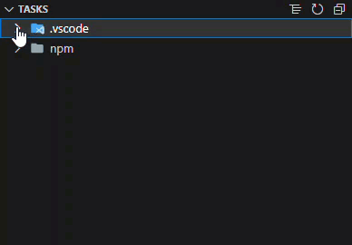
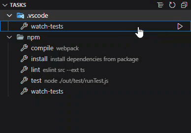
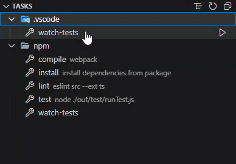
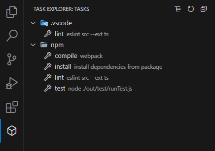

# Task View

The Task View extension displays all tasks in a separate view and improves organization and clarity by grouping tasks.

## Contents

- [Features](#features)
    - [List of all available Tasks](#list-of-all-available-tasks)
    - [Run the listed tasks](#run-the-listed-tasks)
    - [Add to Favorites or Remove from Favorites](#add-to-favorites-or-remove-from-favorites)
    - [Automatic Refresh of the View](#automatic-refresh-of-the-view)
    - [Task Explorer](#task-explorer)
- [Known Issues](#known-issues)

## Features

### List of all available Tasks

In your current workspace within VS Code, you can access a dedicated view that lists all available tasks. This view can be easily activated. To enhance task organization, tasks are grouped based on their working directory, providing a clearer overview of your tasks. Additionally, you have the option to refresh the view as needed and choose between a list or tree format for displaying the tasks.

### Run the listed tasks

The listed tasks can be started with a simple click on the 'Start' button.

### Add to Favorites or Remove from Favorites

The listed tasks can be marked as favorites, and these favorites will be displayed in a dedicated section. You also have the option to remove tasks from your favorites.

### Automatic Refresh of the View

The Task View is automatically updated when changes are made to the extension's configuration and the VS Code tasks.

### Task Explorer

In the Activity Bar, you can find the Task Explorer, which provides easy access to a view where all tasks are listed. Within the Task Explorer, you'll find a clear listing of all available tasks, making it convenient to manage and execute them.

## Known Issues

- Non-VS Code tasks are not automatically updated when new tasks become available.